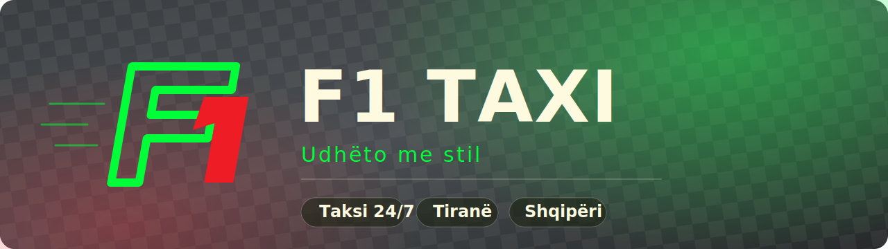

<p align="center">
  
</p>

<p align="center">
  
  
  
</p>

# F1 Taxi — Site

Single-page site for F1 Taxi: a fixed glassmorphic navbar with a fullscreen
car-animation menu, over a plain vertically-scrolling stack of full-height
sections (one per nav item).

## Structure

```
taxi f1/
├── index.html            Semantic markup only — no inline styles/scripts
├── css/
│   ├── base.css          Design tokens (palette, motion, type), reset
│   ├── navbar.css        Fixed top bar: logo + hamburger ↔ X
│   ├── menu.css          Fullscreen overlay: circle reveal, green panel,
│   │                     car drive-in / headlight-blink close, links,
│   │                     socials, SQ/EN toggle
│   └── stage.css         Scrolling sections: backdrops, glow orbs,
│                         giant page numbers, titles
├── js/
│   ├── navbar.js         window.F1.Navbar — menu state, active link,
│   │                     language toggle (persisted to localStorage)
│   ├── main.js           Bootstrap: nav scrolling + active-link
│   │                     tracking via IntersectionObserver
│   ├── hero.js           Kreu typewriter + social reveal
│   ├── scroll.js         Lenis smooth scroll + Kreu exit cinematics
│   ├── experience3d.js   ES module: Three.js 3D car experience in
│   │                     Rreth Nesh (pinned, scroll-scrubbed camera,
│   │                     door rig, pointer parallax)
│   └── vendor/           gsap, ScrollTrigger, lenis, three (ESM),
│                         three-addons (GLTFLoader, RoomEnvironment)
└── assets/
    ├── media/            logo.webp, car-open.png, car-lights.png
    └── models/           drop car.glb here for the 3D experience
                          (placeholder car renders until then)

Note: js/experience3d.js is an ES module — open the site over HTTP
(e.g. `npx serve .` or VS Code Live Server), not file://.
```

## Pages (sections)

Each `[data-slide]` section is a full-height (`100vh`) panel in normal
document flow:

| # | id           |
|---|--------------|
| 1 | `kreu`       |
| 2 | `rreth-nesh` |
| 3 | `sherbimet`  |
| 4 | `cmimet`     |
| 5 | `rezervo`    |
| 6 | `kontakt`    |

## Navigation (`js/main.js`)

- Nav/menu clicks call `navbar.onNavigate(id)`, which `scrollIntoView({
  behavior: 'smooth' })` to the matching section. Native smooth scroll is
  set in CSS (`html { scroll-behavior: smooth }`), with `scroll-padding-top`
  keeping targets clear of the fixed navbar.
- An `IntersectionObserver` (thin band across the viewport middle) sets the
  active nav link to whichever section is centre-screen.
- Reduced-motion users get instant jumps (`scroll-behavior: auto`).

## Conventions

- **CSS:** BEM-ish naming (`block__element--modifier`), state classes are
  `is-*` (`.menu.is-open`), design tokens in `:root` (`base.css`).
- **JS:** classic scripts (work over `file://`), one IIFE per file,
  namespaced under `window.F1`. `main.js` is the only place modules talk
  to each other.
- **i18n:** any element with `data-sq` + `data-en` attributes is swapped
  by the language toggle. Add both attributes to any new text.

## Run

Open `index.html` directly, or serve it:

```sh
npx serve .
```

## TODO

- [ ] Per-page content (currently title-only placeholders)
- [ ] Real social links + contact details
- [ ] OG/meta tags + favicon set before launch
```
